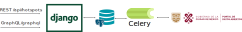

# WiFi Access Point Location (wapl) API CDMX

API Rest of WiFi access points location in the CDMX

[](https://github.com/cookiecutter/cookiecutter-django/)

## Architecture

[See more (ES)](explicacion.md). 

## Data flow


## Development

### First step

Build docker images:

```bash
cd wapl
docker-compose -f local.yml build
```

Up all servicies

```bash
docker-compose -f local.yml up
```

Create super user

```bash
docker-compose -f local.yml run --rm django python manage.py createsuperuser
```

### Load data

The loading of information is handled by a celery task. It is programmed by default every 6 hours (UTC). This can be changed in file `wapl/hotspots/tasks.pu`. For the first load it is recommended to program every five minutes.

```python
sender.add_periodic_task(
    crontab(minute="*/5"),
    get_hotspots.s(),
)
```

This task update all data base, it is recommended to return to the default value at the end of the first load.

## Using

### REST API

#### `/api/hotspots/`
This endpoint admits the next querys:
1. GET `/api/hotspots/` Retrieve hotspots.
2. GET `/api/hotspots/?name=&address=&program=` Retrieve hotspot filtered by name, address and program.
3. GET `/api/hotspots/?search=` Search by name or address
4. GET `/api/hotspots/?lat=&long=` Retrive hotspot near a given latitude and longitude
5. GET `/api/hotspot/[name]/` Retrive data a hotspot by name

All answers are paginated.

### GraphQL

#### `/api/graph`

All hotspot, paginated.

```graphql
query  {
    allHotspots {
        pageInfo {
            startCursor
            endCursor
            hasNextPage
            hasPreviousPage
        }
        edge {
            node {
                id
                name
                program
                installed_date
                lat
                long
                address
                mayoralty
            }
        }
    }
}
```

Get a hotspot

```graphql
query {
    hotspots(id:"id") {
        id
        name
        program
        installed_date
        lat
        long
        address
        mayoralty
    }
}
```

Retrieve neat hotspot

```graphql
query {
    nearbyHotspots(lat:num, long:num) {
        pageInfo {
            startCursor
            endCursor
            hasNextPage
            hasPreviousPage
        }
        edge {
            node {
                id
                name
                program
                installed_date
                lat
                long
                address
                mayoralty
            }
        }
    } 
}
```

## To-do
1. Implement authentication on graphql, to deploy.
2. Unit testing.
3. Clean unused code generated by Cookiecutter Django.


## License

Copyright (c) 2022 Héctor Olvera Vital

Licensed under the [MIT License](LICENSE).
